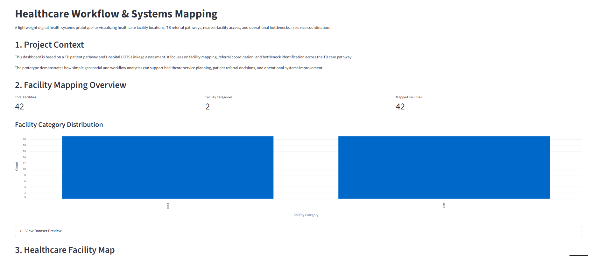
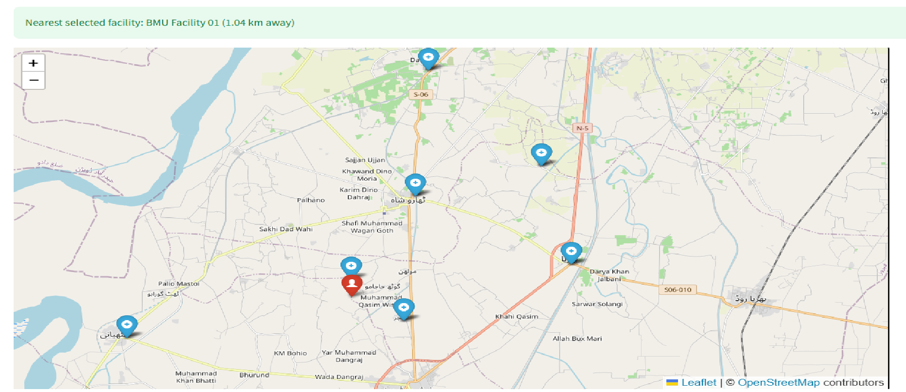
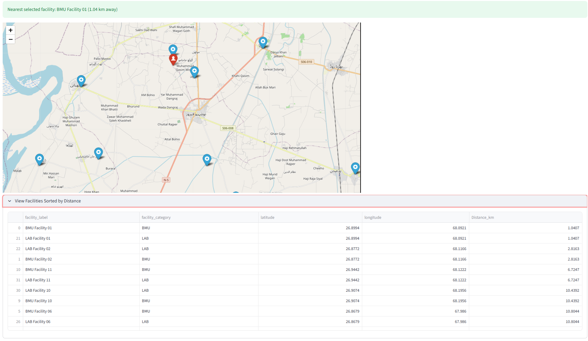
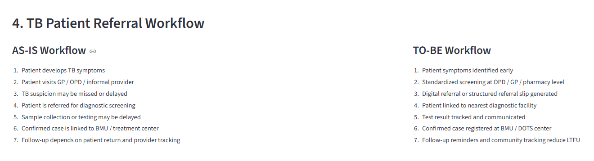
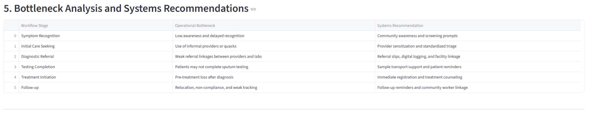

[Live Streamlit App](https://healthcare-workflow-systems-mapping-n2imcxtqongdzloabdnu36.streamlit.app/)

# Healthcare Workflow & Systems Mapping

A lightweight digital health systems prototype focused on healthcare facility mapping, TB referral workflows, patient pathway visualization, and operational systems analysis.

This project demonstrates how geospatial analytics, workflow mapping, and operational systems thinking can support healthcare systems planning, referral coordination, healthcare accessibility analysis, and operational bottleneck identification within district-level TB care pathways.

---

## Dashboard Preview

### Main Dashboard Overview

### Interactive Healthcare Facility Mapping

### Nearest Facility Analysis

### Workflow Analysis

### Bottleneck Analysis

---

## Project Overview

The prototype was developed to explore how healthcare workflow visualization and facility-level mapping can improve understanding of:

- Referral coordination pathways
- Service accessibility and healthcare reach
- Facility linkage systems
- Patient movement across care stages
- Operational bottlenecks affecting diagnosis, treatment initiation, and follow-up
- Basic healthcare accessibility and nearest-facility analysis

The dashboard combines healthcare systems thinking with lightweight analytics and geospatial visualization techniques to create an interactive operational mapping prototype.

---

## Core Features

### Interactive Healthcare Facility Mapping
- Geospatial visualization of healthcare facilities
- Facility category filtering
- Interactive facility markers and information popups

### Nearest Facility Analysis
- Simulated patient/community location input
- Distance-based nearest facility identification
- Basic healthcare accessibility visualization

### Workflow & Referral Systems Analysis
- AS-IS TB referral workflow mapping
- TO-BE workflow transformation visualization
- Patient pathway analysis

### Operational Bottleneck Assessment
- Identification of referral coordination gaps
- Workflow fragmentation analysis
- Systems-oriented operational recommendations

---

## Tools & Technologies

- Python
- Streamlit
- Pandas
- Folium
- Plotly
- OpenPyXL
- GitHub

---

## Key Concepts Demonstrated

- Healthcare Systems Mapping
- Digital Health Workflows
- Referral Coordination Systems
- Operational Systems Thinking
- TB Patient Pathway Analysis
- Geospatial Healthcare Analytics
- Healthcare Access Visualization
- Workflow Bottleneck Analysis

---

## Sample Outputs

- Interactive healthcare facility map
- Facility category distribution analysis
- Nearest facility identification prototype
- AS-IS vs TO-BE workflow visualization
- Referral systems bottleneck analysis
- Operational systems recommendations

---

## Potential Future Expansion

Future versions of the prototype could incorporate more advanced digital health and operational analytics capabilities, including:

- GPS/mobile-device location integration
- Live patient routing and navigation support
- Travel-time and accessibility analysis
- Healthcare accessibility scoring models
- Referral optimization workflows
- Facility capacity and utilization mapping
- Dynamic catchment-area visualization
- Integration with digital referral systems
- Real-time operational dashboards
- Community health worker coordination tools

These additions could further support healthcare accessibility analysis, referral coordination, operational visibility, and digital health systems planning.

---

## Project Context

This prototype is inspired by healthcare systems and TB patient pathway assessment work conducted during academic and consultancy-related project experience within a healthcare management context.

The project demonstrates how lightweight digital tools can support operational visibility, healthcare coordination analysis, and workflow-oriented systems thinking in healthcare environments.

---

## Disclaimer

This repository has been developed solely for educational, academic, research, and portfolio demonstration purposes.

All datasets, workflow representations, analyses, and visualizations included in this repository have been simplified, anonymized, modified, recreated, or abstracted for demonstration purposes. No confidential patient information, personally identifiable information (PII), or restricted institutional operational data is included.

This project does not represent an official operational healthcare platform, institutional system, donor product, or live implementation environment.

Any resemblance to real healthcare systems, workflows, or facilities is purely for conceptual and educational demonstration within a systems analysis and digital health learning context.
